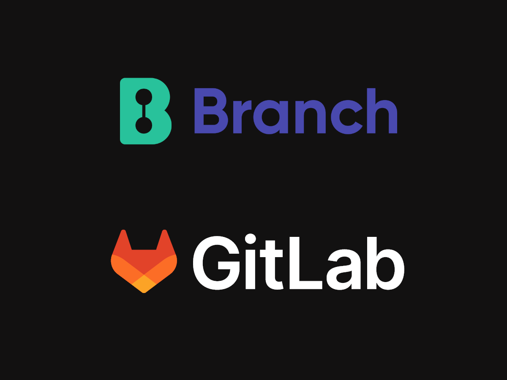

# WordPress Branch Theme
This is a FSE WordPress theme that is being deployed using a CI tool called [Branch](https://www.branchci.com/).

The focus of this repo is not necesarrily on the theme itself (although I am curious to learn more about what's possible with FSE) but to focus on a new (to me) CI pipeline used to deploy WordPress themes directly to the host with a single ```git push```.



Still playing around with the Hobby version, but I'm eager to use Branch more and see if I can get more people excited about it.